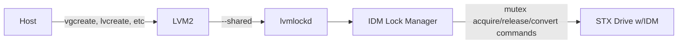

Propeller - LVM Locking scheme for Seagate In-Drive Mutex
===============================================

This repository provides a customized locking manager that integrates
Seagate's In-Drive Mutex (IDM) with lvmlockd. The IDM feature present in Seagate's SSD
enforces access at the drive level, revealing a single point of authority that connected hosts can use
to check if they have access to data on the drive. 

`src/` contains the source code for the IDM lock manager and the IDM wrapper API lib.  
`test/` contains the testing harness for the IDM lock manager. This includes smoke tests written in C and unit tests written in Python that utilize the PyTest testing framework.   
`python/` contains SWIG files used to generate Python wrapper API in support of the test harness located in `test/`.  
`doc/` contains the supporting documentation for the project such as building, testing, debugging, etc.  
`debian/` contains supporting files for generating debian packages for the IDM lock manager.  
`seagate_ilm.spec` is used to build RPM packages for the IDM lock manager.  

The IDM lock manager's library and APIs are implemented in C.

Building and Installation
-------------------------

See [LVM and IDM lock manager installation](doc/lvm_propeller_install.md) for details.

Environment Variables and Logging
---------------------------------

See [LVM and IDM lock manager debugging](doc/lvm_propeller_debug.md) for details.

Testing
-------

See [LVM and IDM lock manager testing](doc/lvm_propeller_test.md) for details.
