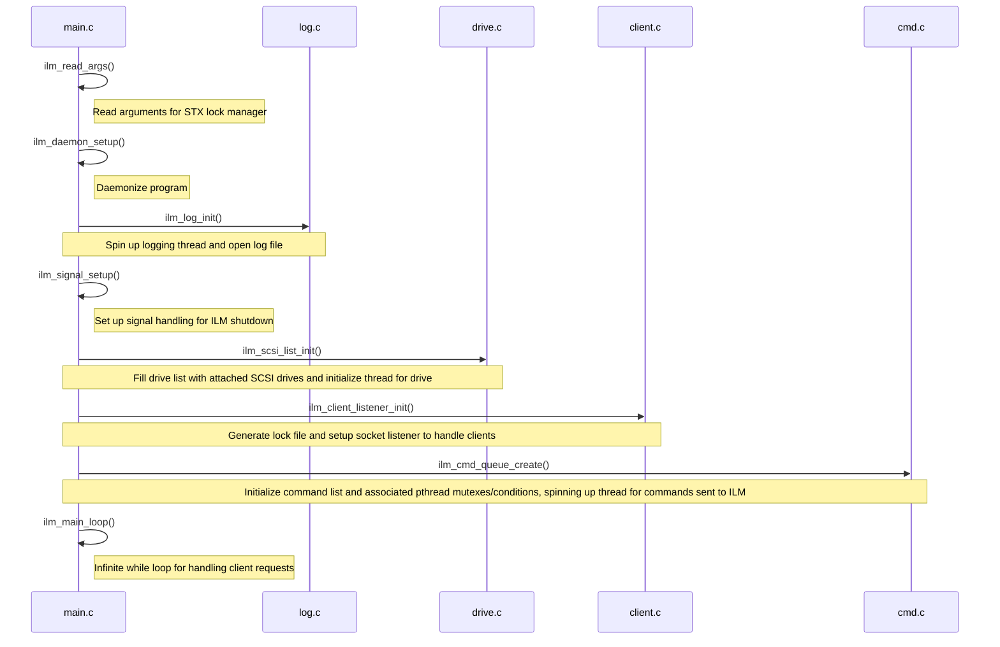
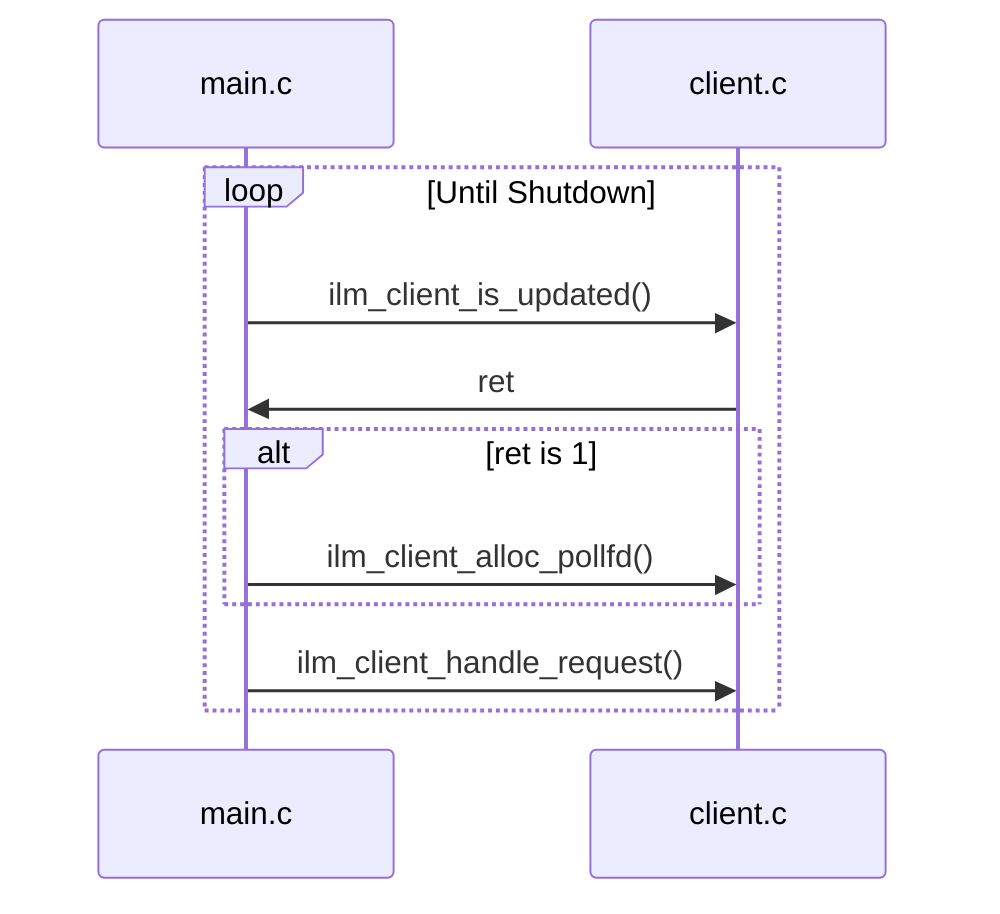
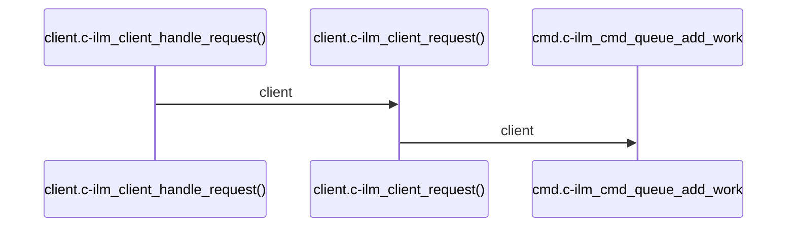

# Propeller Source Code Documentation

## Initialization

## Main Loop

## client.c/client.h
This handles client requests by setting up a listener on start-up. Clients that connect are added to a global list of client structs.
https://github.com/brandonohare/propeller/blob/32c06a6a51914ce00e2f38b7120d7d301d6a221c/src/client.h#L18-L27
Once the clients are part of the global list, their states can updated and requests they send can be handled and results sent back to the correct file descriptors.

We start off by adding a client to the list, with a function to be handled: ilm_client_connect().
```mermaid
sequenceDiagram
ilm_client_listener_init() ->> ilm_client_add(): listener_sock_fd, ilm_client_connect(), NULL
ilm_client_add() ->> list_add(): client
```
[The main loop](#main-loop), which is checking if the client list is updated, notices the update. It polls the file descriptor and handles the connection. 
Connecting to the client adds the client back to the list to handle their following request after establishing connection. 
```mermaid
sequenceDiagram
ilm_client_connect() ->> ilm_client_add(): client_fd, ilm_client_request, NULL
ilm_client_add() ->> list_add(): client
```
After the [main loop](#main-loop) handles this second request, it uses ilm_client_request() to recv a command from the client and add it to the command queue.

## cmd.c/cmd.h

## drive.c/drive.h

## failure.c/failure.c

## idm_pthread_backend.c

## idm_scsi.c

## idm_wrapper.h

## ilm.h

## ilm_internal.h

## inject_fault.c/inject_fault.h

## lib_client.c
This file provides the API for lvmlockd to use the IDM lock manager. This allows lvmlockd to connect to the socket, create lockspaces, check locks, etc.
## libseagate_ilm.pc
This is the package config file, which assists LVM in checking if the IDM lock manager is installed before configuring LVM to use it.
## list.h
This file is based on the standard Linux linked-list structure and is used by files such as `client.c` to create a client list. 
## lock.c/lock.h

## lockspace.c/lockspace.h

## log.c/log.h

## logrotate.ilm

## main.c

## raid_lock.c/raidlock.h

## scsiutils.c/scsiutils.h

## seagate_ilm.service

## util.c/util.h

## uuid.c/uuid.h
