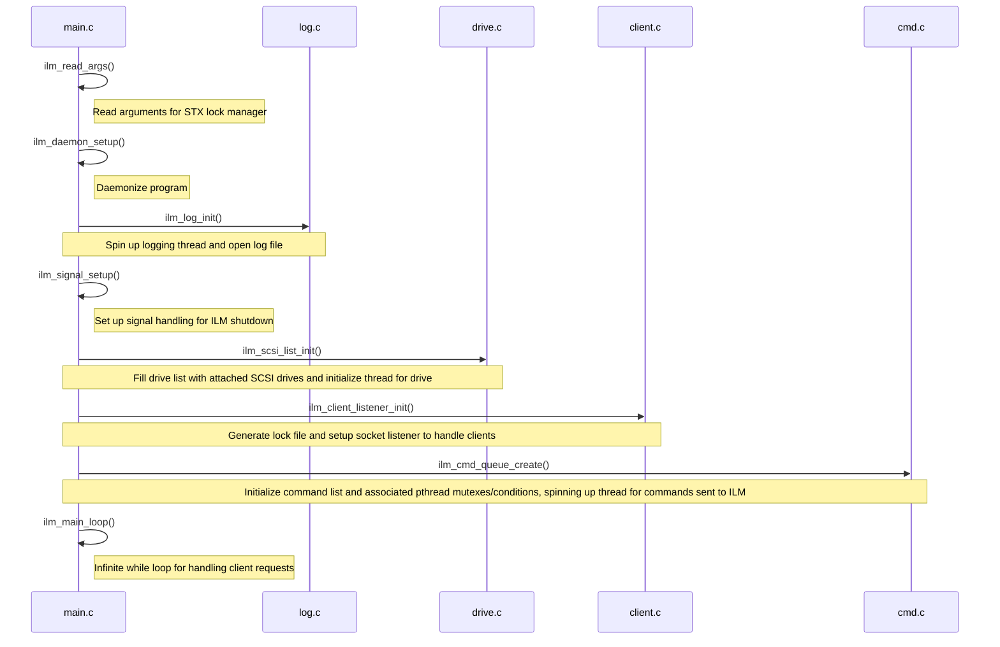
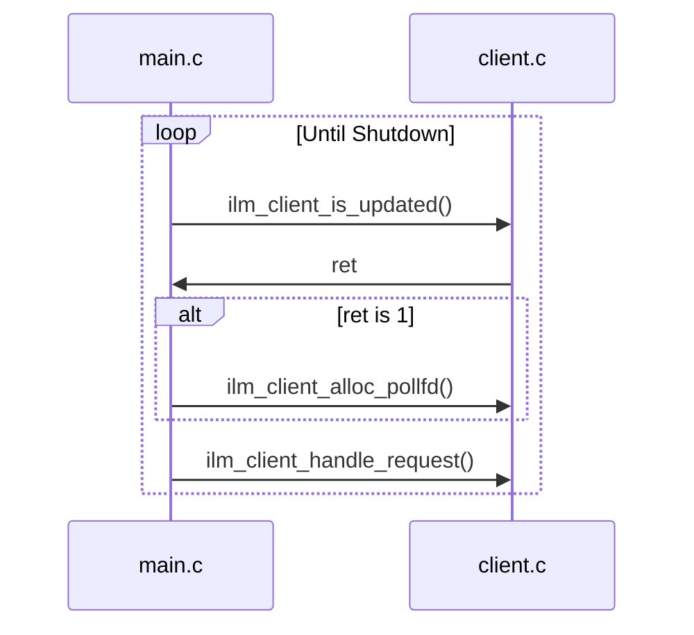

# Propeller Source Code Documentation

## Initialization

## Main Loop

## client.c/client.h
This handles client requests by setting up a listener on start-up. Clients that connect are added to a global list of client structs.
https://github.com/brandonohare/propeller/blob/32c06a6a51914ce00e2f38b7120d7d301d6a221c/src/client.h#L18-L27
Once the clients are part of the global list, their states can updated and requests they send can be handled and results sent back to the correct file descriptors. 
## cmd.c/cmd.h

## drive.c/drive.h

## failure.c/failure.c

## idm_pthread_backend.c

## idm_scsi.c

## idm_wrapper.h

## ilm.h

## ilm_internal.h

## inject_fault.c/inject_fault.h

## lib_client.c

## libseagate_ilm.pc

## list.h

## lock.c/lock.h

## lockspace.c/lockspace.h

## log.c/log.h

## logrotate.ilm

## main.c

## raid_lock.c/raidlock.h

## scsiutils.c/scsiutils.h

## seagate_ilm.service

## util.c/util.h

## uuid.c/uuid.h
