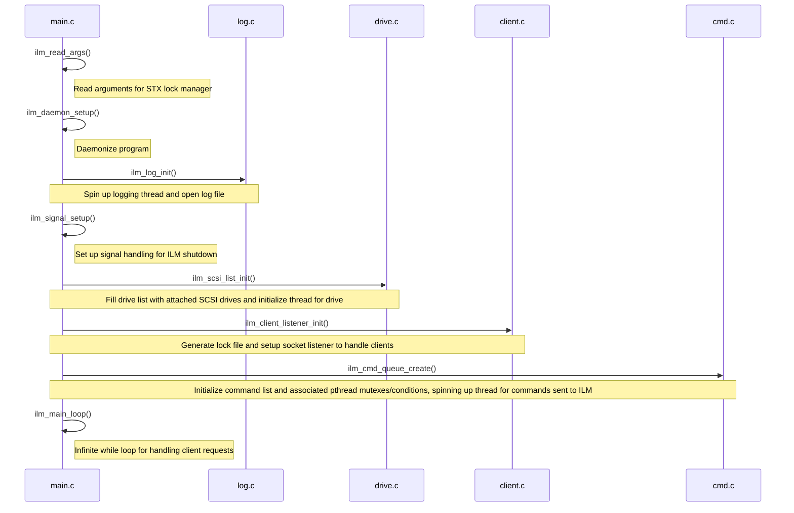
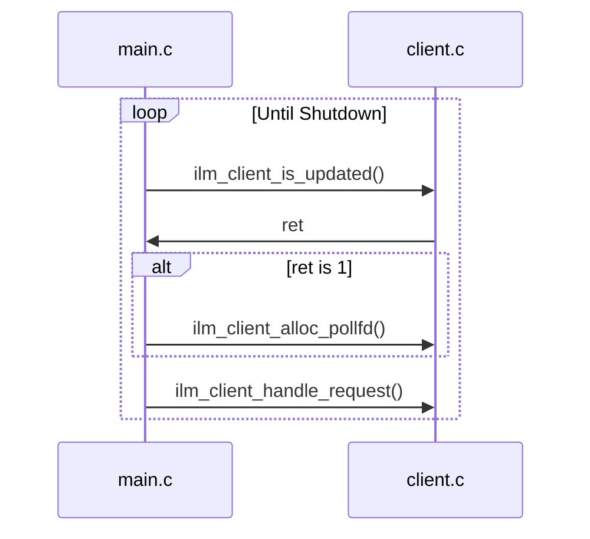
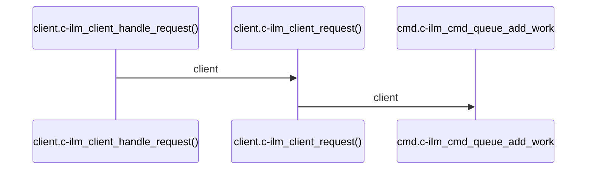

# Propeller Source Code Documentation
This documentation is meant to give a generalized view of the functionality of the code in this project. Diagrams are not a 1:1 match with the code, as they are meant to explain the functionality at a higher-level. Self-explanatory functions or instantiations are skipped over to reduce complexity. 
## Initialization

## Main Loop

## client.c/client.h
This handles client requests by setting up a listener on start-up. Clients that connect are added to a global list of client structs.
https://github.com/brandonohare/propeller/blob/32c06a6a51914ce00e2f38b7120d7d301d6a221c/src/client.h#L18-L27
Once the clients are part of the global list, their states can updated and requests they send can be handled and results sent back to the correct file descriptors.

We start off by adding a client to the list, with a function to be handled: ilm_client_connect().
```mermaid
sequenceDiagram
ilm_client_listener_init() ->> ilm_client_add(): listener_sock_fd, ilm_client_connect(), NULL
ilm_client_add() ->> list_add(): client
```
[The main loop](#main-loop), which is checking if the client list is updated, notices the update. It polls the file descriptor and handles the connection. 
Connecting to the client adds the client back to the list to handle their following request after establishing connection. 
```mermaid
sequenceDiagram
ilm_client_connect() ->> ilm_client_add(): client_fd, ilm_client_request, NULL
ilm_client_add() ->> list_add(): client
```
After the [main loop](#main-loop) handles this second request, it uses ilm_client_request() to recv a command from the client and add it to the command queue.

## cmd.c/cmd.h
During [initialization](#initialization), ilm_cmd_queue_create(void) will initialize the command queue and spin up the command handler threads. A handler thread will wait until the command queue is no longer empty, triggering the command handler:
```mermaid
sequenceDiagram
Loop Until Shutdown
  alt cmd_queue not empty
    ilm_cmd_thread() ->> ilm_cmd_handle(): cmd
  end
end
```
The handler will check the command and send the command to the correct function in either `lock.c` or `lockspace.c`.
```mermaid
sequenceDiagram
opt lock command
  cmd.c|ilm_cmd_handle() ->> cmd.c|ilm_cmd_lock_xxx(): cmd
  cmd.c|ilm_cmd_lock_xxx() ->> lock.c|ilm_lock_xxx(): cmd
  Note over cmd.c|ilm_cmd_handle(), lock.c|ilm_lock_xxx(): local helper function directs command to lock.c file
end
opt lockspace command
  cmd.c|ilm_cmd_handle() ->> cmd.c|ilm_cmd_lockspace_xxx(): cmd
  cmd.c|ilm_cmd_lockspace_xxx() ->> lockspace.c|ilm_lockspace_xxx(): cmd
  Note over cmd.c|ilm_cmd_handle(), lock.c|ilm_lockspace_xxx(): local helper function directs command to lockspace.c file
end
```
## drive.c/drive.h
The `drive.c` code handles the heavy lifting associated with maintaining the drive list. This includes the drive thread that maintains the list, and the helper functions for tasks such as finding a drive's path, SCSI generic (sg) node, WWN, UUID. It also can rescan the drive list uses the udev library to monitor and remove dead drives from the list and return the drive list version. 

The drive thread function uses a udev monitor to track actions associated with the drives, and update the drive list accordingly:
```mermaid
sequenceDiagram
Loop Until Shutdown
  opt udev signal
    drive_thd_function() ->> udev_monitor_recieve_device(): monitor
    udev_monitor_recieve_device() ->> drive_thd_function(): device
    drive_thd_function() ->> udev_device_get_action(): device
    udev_device_get_action() ->> drive_thd_function(): action
    alt action = add
      drive_thd_function() ->> ilm_find_sg(): device name
      ilm_find_sg() ->> drive_thd_function(): SCSI generic node
      drive_thd_function() ->> ilm_read_device_wwn(): device path
      ilm_read_device_wwn() ->>  drive_thd_function(): WWN
      drive_thd_function() ->> ilm_scsi_add_drive_path(): device path, SCSI generic node, WWN
    else action = remove
      drive_thd_function() ->> ilm_scsi_del_drive_path(): device path
    else action = change
      drive_thd_function() ->> ilm_scsi_del_drive_path(): device path
      drive_thd_function() ->> ilm_find_sg(): device name
      ilm_find_sg() ->> drive_thd_function(): SCSI generic node
      drive_thd_function() ->> ilm_read_device_wwn(): device path
      ilm_read_device_wwn() ->>  drive_thd_function(): WWN
      drive_thd_function() ->> ilm_scsi_add_drive_path(): device path, SCSI generic node, WWN
    end
  end
end
      
```

## failure.c/failure.c
This file handles the killing of a failed lockspace by utilizing the lockspace's killpath element.
## idm_pthread_backend.c
This is used for running the Seagate lock manager in an emulated state, opting to emulate the IDM instead of contacting the drive. 
## idm_scsi.c

## idm_wrapper.h

## ilm.h

## ilm_internal.h

## inject_fault.c/inject_fault.h

## lib_client.c
This file provides the API for lvmlockd to use the IDM lock manager. This allows lvmlockd to connect to the socket, create lockspaces, check locks, etc.
## libseagate_ilm.pc
This is the package config file, which assists LVM in checking if the IDM lock manager is installed before configuring LVM to use it.
## list.h
This file is based on the standard Linux linked-list structure and is used by files such as `client.c` to create a client list. 
## lock.c/lock.h

## lockspace.c/lockspace.h

## log.c/log.h

## logrotate.ilm

## main.c

## raid_lock.c/raidlock.h

## scsiutils.c/scsiutils.h

## seagate_ilm.service

## util.c/util.h

## uuid.c/uuid.h
